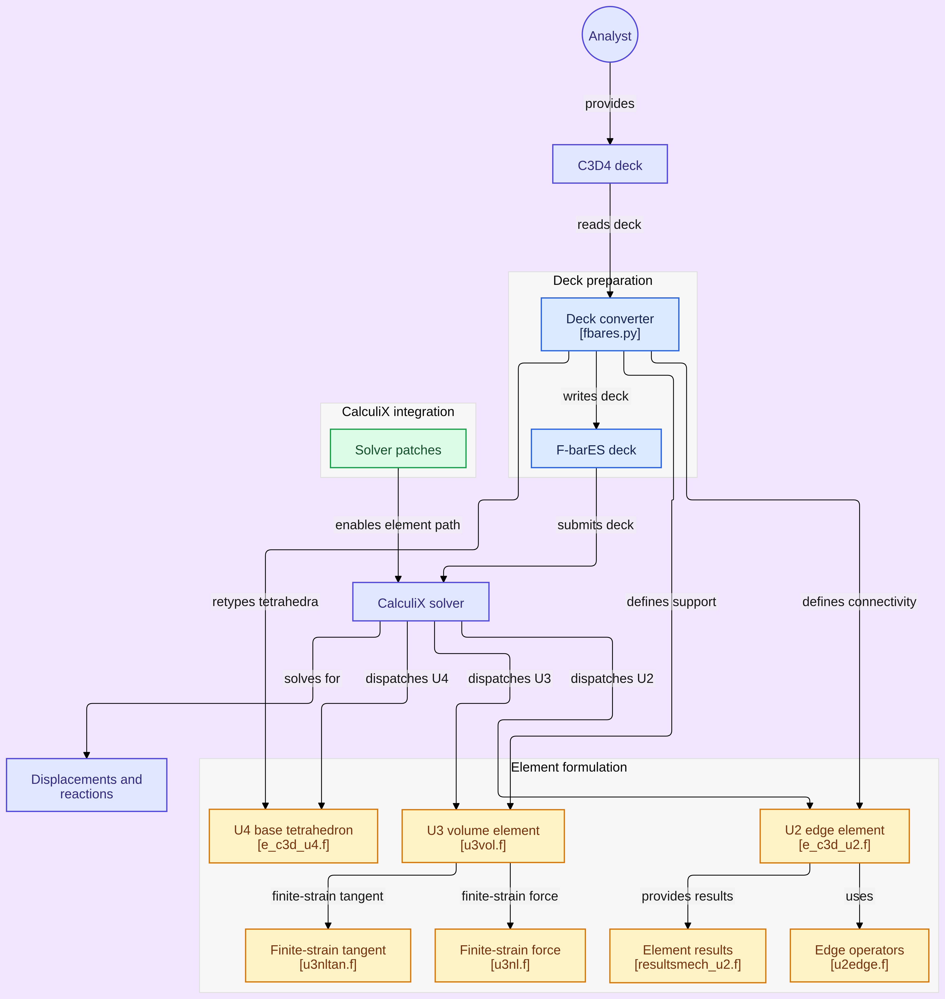
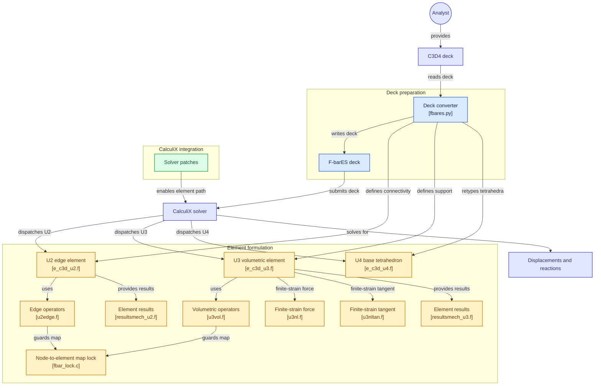

# Architecture

How the pieces connect: the deck converter, the patch series, and the three
user elements with their shared operators and result routines.

The Mermaid source below is authoritative for labels and links; regenerate the
image from it in GitDiagram or mermaid.live after an edit. Click handlers work
in GitDiagram and Mermaid-capable editors; GitHub renders the diagram but
ignores the interactions.

